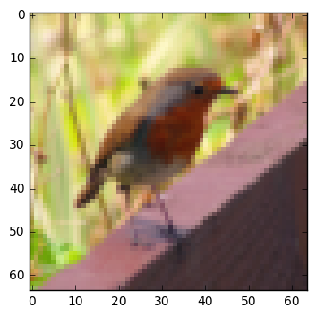
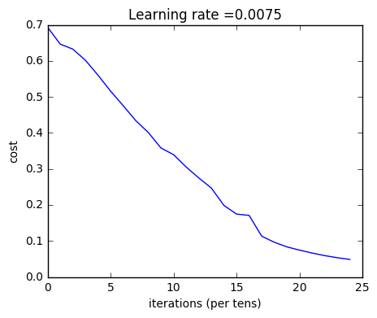
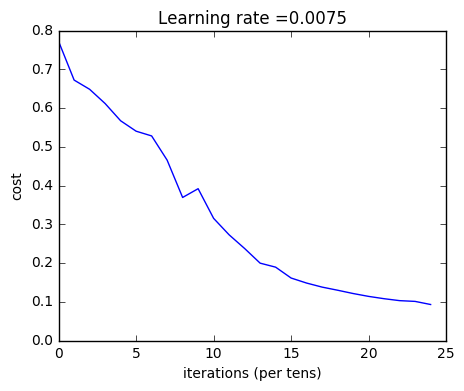
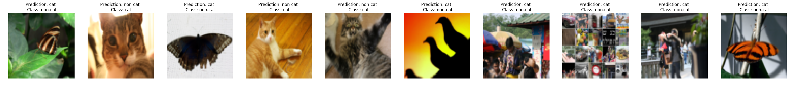

# Deep Neural Network for Image Classification: Application


Let's first import all the packages that I will need during this Project. 
- [numpy](www.numpy.org) is the fundamental package for scientific computing with Python.
- [matplotlib](http://matplotlib.org) is a library to plot graphs in Python.
- [h5py](http://www.h5py.org) is a common package to interact with a dataset that is stored on an H5 file.
- [PIL](http://www.pythonware.com/products/pil/) and [scipy](https://www.scipy.org/) 
- dnn_app_utils provides the functions implemented in the "Building My Deep Neural Network:
- np.random.seed(1) is used to keep all the random function calls consistent.


```python
import matplotlib.pyplot as plt
import numpy as np
from dnn_app_utils_v2 import *

%matplotlib inline
plt.rcParams['figure.figsize'] = (5.0, 4.0) # set default size of plots
plt.rcParams['image.interpolation'] = 'nearest'
plt.rcParams['image.cmap'] = 'gray'

%load_ext autoreload
%autoreload 2

np.random.seed(1)
```

    /opt/conda/lib/python3.5/site-packages/matplotlib/font_manager.py:273: UserWarning: Matplotlib is building the font cache using fc-list. This may take a moment.
      warnings.warn('Matplotlib is building the font cache using fc-list. This may take a moment.')
    /opt/conda/lib/python3.5/site-packages/matplotlib/font_manager.py:273: UserWarning: Matplotlib is building the font cache using fc-list. This may take a moment.
      warnings.warn('Matplotlib is building the font cache using fc-list. This may take a moment.')
    

## 2 - Dataset

I will use the same "Cat vs non-Cat" dataset as in "Logistic Regression as a Neural Network" (Assignment 2). The model I had built had 70% test accuracy on classifying cats vs non-cats images. Hopefully, my new model will perform a better!

**Problem Statement**: I am given a dataset ("data.h5") containing:
    - a training set of m_train images labelled as cat (1) or non-cat (0)
    - a test set of m_test images labelled as cat and non-cat
    - each image is of shape (num_px, num_px, 3) where 3 is for the 3 channels (RGB).

Let's get more familiar with the dataset. Load the data by running the cell below.


```python
train_x_orig, train_y, test_x_orig, test_y, classes = load_data()
```

The following code will show me an image in the dataset. Feel free to change the index and re-run the cell multiple times to see other images. 


```python
# Example of a picture
index = 10
plt.imshow(train_x_orig[index])
print ("y = " + str(train_y[0,index]) + ". It's a " + classes[train_y[0,index]].decode("utf-8") +  " picture.")
```

    y = 0. It's a non-cat picture.
    





```python
# Explore my dataset 
m_train = train_x_orig.shape[0]
num_px = train_x_orig.shape[1]
m_test = test_x_orig.shape[0]

print ("Number of training examples: " + str(m_train))
print ("Number of testing examples: " + str(m_test))
print ("Each image is of size: (" + str(num_px) + ", " + str(num_px) + ", 3)")
print ("train_x_orig shape: " + str(train_x_orig.shape))
print ("train_y shape: " + str(train_y.shape))
print ("test_x_orig shape: " + str(test_x_orig.shape))
print ("test_y shape: " + str(test_y.shape))
```

    Number of training examples: 209
    Number of testing examples: 50
    Each image is of size: (64, 64, 3)
    train_x_orig shape: (209, 64, 64, 3)
    train_y shape: (1, 209)
    test_x_orig shape: (50, 64, 64, 3)
    test_y shape: (1, 50)
    

As usual, I have to reshape and standardize the images before feeding them to the network. The code is given in the cell below.


<caption><center> <u>Figure 1</u>: Image to vector conversion. <br> </center></caption>


```python
# Reshape the training and test examples 
train_x_flatten = train_x_orig.reshape(train_x_orig.shape[0], -1).T   # The "-1" makes reshape flatten the remaining dimensions
test_x_flatten = test_x_orig.reshape(test_x_orig.shape[0], -1).T

# Standardize data to have feature values between 0 and 1.
train_x = train_x_flatten/255.
test_x = test_x_flatten/255.

print ("train_x's shape: " + str(train_x.shape))
print ("test_x's shape: " + str(test_x.shape))

```

    train_x's shape: (12288, 209)
    test_x's shape: (12288, 50)
    

$12,288$ equals $64 \times 64 \times 3$ which is the size of one reshaped image vector.

## 3 - Architecture of my model

Now since I am familiar with the dataset, it is time to build a deep neural network to distinguish cat images from non-cat images.

I am going to build two different models:
- A 2-layer neural network
- An L-layer deep neural network

then I will compare the performance of these models, and also try out different values for $L$. 

Let's look at the two architectures.

### 3.1 - 2-layer neural network


<caption><center> <u>Figure 2</u>: 2-layer neural network. <br> The model can be summarized as: ***INPUT -> LINEAR -> RELU -> LINEAR -> SIGMOID -> OUTPUT***. </center></caption>

<u>Detailed Architecture of figure 2</u>:
- The input is a (64,64,3) image which is flattened to a vector of size $(12288,1)$. 
- The corresponding vector: $[x_0,x_1,...,x_{12287}]^T$ is then multiplied by the weight matrix $W^{[1]}$ of size $(n^{[1]}, 12288)$.
- then I add a bias term and take its relu to get the following vector: $[a_0^{[1]}, a_1^{[1]},..., a_{n^{[1]}-1}^{[1]}]^T$.
- then I go ahead and repeat the same process.
- I'll multiply the resulting vector by $W^{[2]}$ and add intercept (bias). 
- Finally, I have take the sigmoid of the result. If it is greater than 0.5, I would classify it to be a cat.

### 3.2 - L-layer deep neural network

It is hard to represent an L-layer deep neural network with the above representation. However, here is a simplified network representation:


<caption><center> <u>Figure 3</u>: L-layer neural network. <br> The model can be summarized as: ***[LINEAR -> RELU] $\times$ (L-1) -> LINEAR -> SIGMOID***</center></caption>

<u>Detailed Architecture of figure 3</u>:
- The input is a (64,64,3) image which is flattened to a vector of size (12288,1).
- The corresponding vector: $[x_0,x_1,...,x_{12287}]^T$ is then multiplied by the weight matrix $W^{[1]}$ and then I added the intercept $b^{[1]}$. The result is called the linear unit.
- Next, I toke the relu of the linear unit. This process could be repeated several times for each $(W^{[l]}, b^{[l]})$ depending on the model architecture.
- Finally, I toke the sigmoid of the final linear unit. If it is greater than 0.5, I would classify it to be a cat.

### 3.3 - General methodology

As usual I will follow the Deep Learning methodology to build the model:
    1. Initialize parameters / Define hyperparameters
    2. Loop for num_iterations:
        a. Forward propagation
        b. Compute cost function
        c. Backward propagation
        d. Update parameters (using parameters, and grads from backprop) 
    4. Use trained parameters to predict labels

Let me to implement those two models!

## 4 - Two-layer neural network

**Question**:  I use the helper functions I have to implemented to build a 2-layer neural network with the following structure: *LINEAR -> RELU -> LINEAR -> SIGMOID*. The functions I may need and their inputs are:
```python
def initialize_parameters(n_x, n_h, n_y):
    ...
    return parameters 
def linear_activation_forward(A_prev, W, b, activation):
    ...
    return A, cache
def compute_cost(AL, Y):
    ...
    return cost
def linear_activation_backward(dA, cache, activation):
    ...
    return dA_prev, dW, db
def update_parameters(parameters, grads, learning_rate):
    ...
    return parameters
```


```python
### CONSTANTS DEFINING THE MODEL ####
n_x = 12288     # num_px * num_px * 3
n_h = 7
n_y = 1
layers_dims = (n_x, n_h, n_y)
```


```python
# GRADED FUNCTION: two_layer_model

def two_layer_model(X, Y, layers_dims, learning_rate = 0.0075, num_iterations = 3000, print_cost=False):
    """
    Implements a two-layer neural network: LINEAR->RELU->LINEAR->SIGMOID.
    
    Arguments:
    X -- input data, of shape (n_x, number of examples)
    Y -- true "label" vector (containing 0 if cat, 1 if non-cat), of shape (1, number of examples)
    layers_dims -- dimensions of the layers (n_x, n_h, n_y)
    num_iterations -- number of iterations of the optimization loop
    learning_rate -- learning rate of the gradient descent update rule
    print_cost -- If set to True, this will print the cost every 100 iterations 
    
    Returns:
    parameters -- a dictionary containing W1, W2, b1, and b2
    """
    
    np.random.seed(1)
    grads = {}
    costs = []                              # to keep track of the cost
    m = X.shape[1]                           # number of examples
    (n_x, n_h, n_y) = layers_dims
    
    # Initialize parameters dictionary, by calling one of the functions I'd previously implemented
    ### START CODE HERE ### (≈ 1 line of code)
    parameters = initialize_parameters(n_x, n_h, n_y)
    ### END CODE HERE ###
    
    # Get W1, b1, W2 and b2 from the dictionary parameters.
    W1 = parameters["W1"]
    b1 = parameters["b1"]
    W2 = parameters["W2"]
    b2 = parameters["b2"]
    
    # Loop (gradient descent)

    for i in range(0, num_iterations):

        # Forward propagation: LINEAR -> RELU -> LINEAR -> SIGMOID. Inputs: "X, W1, b1". Output: "A1, cache1, A2, cache2".
        ### START CODE HERE ### (≈ 2 lines of code)
        A1, cache1 = linear_activation_forward(X, W1, b1, "relu")
        A2, cache2 = linear_activation_forward(A1, W2, b2, "sigmoid")
        ### END CODE HERE ###
        
        # Compute cost
        ### START CODE HERE ### (≈ 1 line of code)
        cost = compute_cost(A2, Y)
        ### END CODE HERE ###
        
        # Initializing backward propagation
        dA2 = - (np.divide(Y, A2) - np.divide(1 - Y, 1 - A2))
        
        # Backward propagation. Inputs: "dA2, cache2, cache1". Outputs: "dA1, dW2, db2; also dA0 (not used), dW1, db1".
        ### START CODE HERE ### (≈ 2 lines of code)
        dA1, dW2, db2 = linear_activation_backward(dA2, cache2, "sigmoid")
        dA0, dW1, db1 = linear_activation_backward(dA1, cache1, "relu")
        ### END CODE HERE ###
        
        # Set grads['dWl'] to dW1, grads['db1'] to db1, grads['dW2'] to dW2, grads['db2'] to db2
        grads['dW1'] = dW1
        grads['db1'] = db1
        grads['dW2'] = dW2
        grads['db2'] = db2
        
        # Update parameters.
        ### START CODE HERE ### (approx. 1 line of code)
        parameters = update_parameters(parameters, grads, learning_rate)
        ### END CODE HERE ###

        # Retrieve W1, b1, W2, b2 from parameters
        W1 = parameters["W1"]
        b1 = parameters["b1"]
        W2 = parameters["W2"]
        b2 = parameters["b2"]
        
        # Print the cost every 100 training example
        if print_cost and i % 100 == 0:
            print("Cost after iteration {}: {}".format(i, np.squeeze(cost)))
        if print_cost and i % 100 == 0:
            costs.append(cost)
       
    # plot the cost

    plt.plot(np.squeeze(costs))
    plt.ylabel('cost')
    plt.xlabel('iterations (per tens)')
    plt.title("Learning rate =" + str(learning_rate))
    plt.show()
    
    return parameters
```

in mean time I run the cell below to train my parameters. See if my model runs. The cost should be decreasing. It may take up to 5 minutes to run 2500 iterations. I'll Check if the "Cost after iteration 0" matches the expected output below, if not click on the square (⬛) on the upper bar of the notebook to stop the cell and try to find my error.


```python
parameters = two_layer_model(train_x, train_y, layers_dims = (n_x, n_h, n_y), num_iterations = 2500, print_cost=True)
```

    Cost after iteration 0: 0.693049735659989
    Cost after iteration 100: 0.6464320953428849
    Cost after iteration 200: 0.6325140647912678
    Cost after iteration 300: 0.6015024920354665
    Cost after iteration 400: 0.5601966311605748
    Cost after iteration 500: 0.515830477276473
    Cost after iteration 600: 0.4754901313943325
    Cost after iteration 700: 0.43391631512257495
    Cost after iteration 800: 0.4007977536203886
    Cost after iteration 900: 0.35807050113237987
    Cost after iteration 1000: 0.3394281538366413
    Cost after iteration 1100: 0.30527536361962654
    Cost after iteration 1200: 0.2749137728213015
    Cost after iteration 1300: 0.24681768210614827
    Cost after iteration 1400: 0.1985073503746611
    Cost after iteration 1500: 0.17448318112556593
    Cost after iteration 1600: 0.1708076297809661
    Cost after iteration 1700: 0.11306524562164737
    Cost after iteration 1800: 0.09629426845937163
    Cost after iteration 1900: 0.08342617959726878
    Cost after iteration 2000: 0.0743907870431909
    Cost after iteration 2100: 0.06630748132267938
    Cost after iteration 2200: 0.05919329501038176
    Cost after iteration 2300: 0.05336140348560564
    Cost after iteration 2400: 0.048554785628770226
    





**Expected Output**:
<table> 
    <tr>
        <td> **Cost after iteration 0**</td>
        <td> 0.6930497356599888 </td>
    </tr>
    <tr>
        <td> **Cost after iteration 100**</td>
        <td> 0.6464320953428849 </td>
    </tr>
    <tr>
        <td> **...**</td>
        <td> ... </td>
    </tr>
    <tr>
        <td> **Cost after iteration 2400**</td>
        <td> 0.048554785628770206 </td>
    </tr>
</table>

Good thing I have built a vectorized implementation! Otherwise it might have taken 10 times longer to train this.

Now, I can use the trained parameters to classify images from the dataset. To see my predictions on the training and test sets, run the cell below.


```python
predictions_train = predict(train_x, train_y, parameters)
```

    Accuracy: 1.0
    

**Expected Output**:
<table> 
    <tr>
        <td> **Accuracy**</td>
        <td> 1.0 </td>
    </tr>
</table>


```python
predictions_test = predict(test_x, test_y, parameters)
```

    Accuracy: 0.72
    

**Expected Output**:

<table> 
    <tr>
        <td> **Accuracy**</td>
        <td> 0.72 </td>
    </tr>
</table>

**Note**: I may notice that running the model on fewer iterations (say 1500) gives better accuracy on the test set. This is called "early stopping"  Early stopping is a way to prevent overfitting. 

Congratulations! It seems that My 2-layer neural network has better performance (72%) than the logistic regression implementation. Let's see if I would can do even better with an $L$-layer model.

## 5 - L-layer Neural Network

**Question**: I'am using the helper functions I have to implemented previously to build an $L$-layer neural network with the following structure: *[LINEAR -> RELU]$\times$(L-1) -> LINEAR -> SIGMOID*. The functions I have used may need and their inputs are:
```python
def initialize_parameters_deep(layer_dims):
    ...
    return parameters 
def L_model_forward(X, parameters):
    ...
    return AL, caches
def compute_cost(AL, Y):
    ...
    return cost
def L_model_backward(AL, Y, caches):
    ...
    return grads
def update_parameters(parameters, grads, learning_rate):
    ...
    return parameters
```


```python
### CONSTANTS ###
layers_dims = [12288, 20, 7, 5, 1] #  5-layer model
```


```python
# GRADED FUNCTION: L_layer_model

def L_layer_model(X, Y, layers_dims, learning_rate = 0.0075, num_iterations = 3000, print_cost=False):#lr was 0.009
    """
    Implements a L-layer neural network: [LINEAR->RELU]*(L-1)->LINEAR->SIGMOID.
    
    Arguments:
    X -- data, numpy array of shape (number of examples, num_px * num_px * 3)
    Y -- true "label" vector (containing 0 if cat, 1 if non-cat), of shape (1, number of examples)
    layers_dims -- list containing the input size and each layer size, of length (number of layers + 1).
    learning_rate -- learning rate of the gradient descent update rule
    num_iterations -- number of iterations of the optimization loop
    print_cost -- if True, it prints the cost every 100 steps
    
    Returns:
    parameters -- parameters learnt by the model. They can then be used to predict.
    """

    np.random.seed(1)
    costs = []                         # keep track of cost
    
    # Parameters initialization.
    ### START CODE HERE ###
    parameters = initialize_parameters_deep(layers_dims)
    ### END CODE HERE ###
    
    # Loop (gradient descent)
    for i in range(0, num_iterations):

        # Forward propagation: [LINEAR -> RELU]*(L-1) -> LINEAR -> SIGMOID.
        ### START CODE HERE ### (≈ 1 line of code)
        AL, caches = L_model_forward(X, parameters)
        ### END CODE HERE ###
        
        # Compute cost.
        ### START CODE HERE ### (≈ 1 line of code)
        cost = compute_cost(AL, Y)
        ### END CODE HERE ###
    
        # Backward propagation.
        ### START CODE HERE ### (≈ 1 line of code)
        grads = L_model_backward(AL, Y, caches)
        ### END CODE HERE ###
 
        # Update parameters.
        ### START CODE HERE ### (≈ 1 line of code)
        parameters = update_parameters(parameters, grads, learning_rate)
        ### END CODE HERE ###
                
        # Print the cost every 100 training example
        if print_cost and i % 100 == 0:
            print ("Cost after iteration %i: %f" %(i, cost))
        if print_cost and i % 100 == 0:
            costs.append(cost)
            
    # plot the cost
    plt.plot(np.squeeze(costs))
    plt.ylabel('cost')
    plt.xlabel('iterations (per tens)')
    plt.title("Learning rate =" + str(learning_rate))
    plt.show()
    
    return parameters
```

Now will I train the model as a 5-layer neural network. 

I ran the cell below to train my model. The cost should decrease on every iteration. It may take up to 5 minutes to run 2500 iterations. Check if the "Cost after iteration 0" matches the expected output below, if not I have to click on the square (⬛) on the upper bar of the notebook to stop the cell and try to find my error.


```python
parameters = L_layer_model(train_x, train_y, layers_dims, num_iterations = 2500, print_cost = True)
```

    Cost after iteration 0: 0.771749
    Cost after iteration 100: 0.672053
    Cost after iteration 200: 0.648263
    Cost after iteration 300: 0.611507
    Cost after iteration 400: 0.567047
    Cost after iteration 500: 0.540138
    Cost after iteration 600: 0.527930
    Cost after iteration 700: 0.465477
    Cost after iteration 800: 0.369126
    Cost after iteration 900: 0.391747
    Cost after iteration 1000: 0.315187
    Cost after iteration 1100: 0.272700
    Cost after iteration 1200: 0.237419
    Cost after iteration 1300: 0.199601
    Cost after iteration 1400: 0.189263
    Cost after iteration 1500: 0.161189
    Cost after iteration 1600: 0.148214
    Cost after iteration 1700: 0.137775
    Cost after iteration 1800: 0.129740
    Cost after iteration 1900: 0.121225
    Cost after iteration 2000: 0.113821
    Cost after iteration 2100: 0.107839
    Cost after iteration 2200: 0.102855
    Cost after iteration 2300: 0.100897
    Cost after iteration 2400: 0.092878
    





**Expected Output**:
<table> 
    <tr>
        <td> **Cost after iteration 0**</td>
        <td> 0.771749 </td>
    </tr>
    <tr>
        <td> **Cost after iteration 100**</td>
        <td> 0.672053 </td>
    </tr>
    <tr>
        <td> **...**</td>
        <td> ... </td>
    </tr>
    <tr>
        <td> **Cost after iteration 2400**</td>
        <td> 0.092878 </td>
    </tr>
</table>


```python
pred_train = predict(train_x, train_y, parameters)
```

    Accuracy: 0.985645933014
    

<table>
    <tr>
    <td>
    **Train Accuracy**
    </td>
    <td>
    0.985645933014
    </td>
    </tr>
</table>


```python
pred_test = predict(test_x, test_y, parameters)
```

    Accuracy: 0.8
    

**Expected Output**:

<table> 
    <tr>
        <td> **Test Accuracy**</td>
        <td> 0.8 </td>
    </tr>
</table>

Yaay Congrats! It seems that I have 5-layer neural network has better performance (80%) than my 2-layer neural network (72%) on the same test set. 

I made a good performance for this task. Nice job to me :p! 

Though in my next project on "Improving deep neural networks" I will exercise how to obtain even higher accuracy by systematically searching for better hyperparameters (learning_rate, layers_dims, num_iterations,). 

##  6) Results Analysis

First, let me take a look at some images the L-layer model labeled incorrectly. This will show a few mislabeled images. 


```python
print_mislabeled_images(classes, test_x, test_y, pred_test)
```


![png][]


**A few type of images the model tends to do poorly on include:** 
- Cat body in an unusual position
- Cat appears against a background of a similar color
- Unusual cat color and species
- Camera Angle
- Brightness of the picture
- Scale variation (cat is very large or small in image) 

```python
## START CODE HERE ##
my_image = "roller_cat.jpg" # change this to the name of my image file 
my_label_y = [1] # the true class of my image (1 -> cat, 0 -> non-cat)
## END CODE HERE ##

fname = "images/" + my_image
image = np.array(ndimage.imread(fname, flatten=False))
my_image = scipy.misc.imresize(image, size=(num_px,num_px)).reshape((num_px*num_px*3,1))
my_predicted_image = predict(my_image, my_label_y, parameters)

plt.imshow(image)
print ("y = " + str(np.squeeze(my_predicted_image)) + ", my L-layer model predicts a \"" + classes[int(np.squeeze(my_predicted_image)),].decode("utf-8") +  "\" picture.")
```

    Accuracy: 0.0
    y = 0.0, My L-layer model predicts a "non-cat" picture.
    


**References**:

- for auto-reloading external module: http://stackoverflow.com/questions/1907993/autoreload-of-modules-in-ipython



